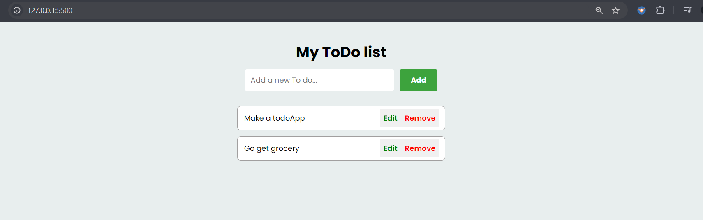

# To-doApp - from the folder "Todo App Local Storage"

Features
Add Tasks: Users can input a task in the text box and click the "Add" button to add the task to the list. The task is stored in the browser's localStorage so that it is not lost when the page is refreshed.

Edit Tasks: Users can edit an existing task by clicking the "Edit" button next to the task. This will populate the input box with the current task text, allowing the user to modify it. Once edited, the task is updated in both the list and the localStorage.

Remove Tasks: Users can remove a task from the list by clicking the "Remove" button next to the task. The task is deleted from both the list and the localStorage.

Persistent Storage: The application uses the browser's localStorage to persist tasks across sessions. This means that even if the page is refreshed or the browser is closed and reopened, the tasks remain in the list.

How It Works
Adding a Task:

When the "Add" button is clicked, the application checks if the input box contains any text.
If the input box is not empty, the task is added to the list and stored in localStorage.
If the "Edit" mode is active, the task is updated in the list and localStorage.
Editing a Task:

When the "Edit" button is clicked, the text of the task is placed back into the input box for editing.
The "Add" button changes its label to "Edit" to indicate that the task is being modified.
Once edited, the task is updated in both the list and localStorage.
Removing a Task:

When the "Remove" button is clicked, the task is deleted from the list and also removed from localStorage.
Loading Tasks:

When the page is loaded, the application retrieves the tasks stored in localStorage and populates the list with them.
Technologies Used
HTML: Structure of the application.
CSS: Styling of the application.
JavaScript: Logic for adding, editing, removing tasks, and interacting with localStorage.
How to Run the Application
Clone or download the project to your local machine.
Open the index.html file in any modern web browser.
The application will load, and you can start adding, editing, or removing tasks.
